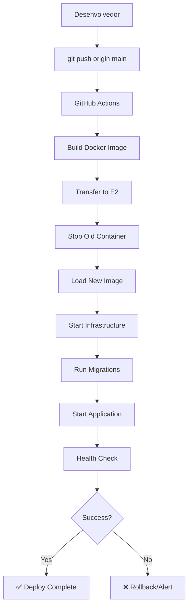

# 📦 Resumo da Configuração de Deploy

## ✅ O que foi configurado

Sistema completo de CI/CD com GitHub Actions para deploy automático na Google Cloud E2.

## 📂 Arquivos Criados

### 🐳 Docker e Containerização
- **`Dockerfile`** - Imagem Docker otimizada multi-stage
- **`.dockerignore`** - Arquivos excluídos do build Docker
- **`docker-compose.prod.yml`** - Compose completo para produção

### 🔄 GitHub Actions Workflows
- **`.github/workflows/deploy.yml`** - Deploy automático na E2
- **`.github/workflows/ci.yml`** - Testes e linting em PRs
- **`.github/workflows/backup.yml`** - Backup automático diário
- **`.github/workflows/security-scan.yml`** - Scan de segurança semanal
- **`.github/PULL_REQUEST_TEMPLATE.md`** - Template para PRs

### 📜 Scripts de Gerenciamento
- **`scripts/setup_gcp_server.sh`** - Setup inicial do servidor E2
- **`scripts/deploy_manual.sh`** - Deploy manual (sem GitHub Actions)
- **`scripts/check_server_status.sh`** - Verificar status dos serviços
- **`scripts/backup_db.sh`** - Backup do banco de dados
- **`scripts/test_deploy_config.sh`** - Testar configuração antes do deploy

### 📖 Documentação
- **`docs/DEPLOY_SETUP.md`** - Guia completo de configuração
- **`DEPLOY_README.md`** - Overview do sistema de deploy
- **`QUICKSTART_DEPLOY.md`** - Início rápido em 10 minutos
- **`RESUMO_CONFIGURACAO_DEPLOY.md`** - Este arquivo
- **`env.template`** - Template de variáveis de ambiente

### ⚙️ Configuração
- **`.gitignore`** - Atualizado com exclusões relevantes

## 🎯 Como Usar

### Primeira Vez

1. **Configurar servidor E2:**
   ```bash
   # Na máquina E2
   wget https://raw.githubusercontent.com/seu-usuario/orkestrai-api/main/scripts/setup_gcp_server.sh
   chmod +x setup_gcp_server.sh
   ./setup_gcp_server.sh
   ```

2. **Configurar secrets no GitHub:**
   - Settings → Secrets and variables → Actions
   - Adicionar: `GCP_HOST`, `GCP_USERNAME`, `GCP_SSH_KEY`

3. **Criar .env na máquina E2:**
   ```bash
   cd ~/orkestrai-api
   cp env.template .env
   nano .env  # Configure suas variáveis
   ```

4. **Testar configuração (opcional):**
   ```bash
   # No seu computador
   ./scripts/test_deploy_config.sh
   ```

5. **Fazer primeiro deploy:**
   ```bash
   git add .
   git commit -m "Setup deploy automático"
   git push origin main
   ```

### Deploy Contínuo

Após configuração inicial, o deploy é automático:

```bash
# Faça suas mudanças
git add .
git commit -m "Sua mensagem"
git push origin main

# GitHub Actions faz o resto automaticamente! 🚀
```

## 📋 Workflows Configurados

### 1. Deploy Automático (`deploy.yml`)
- **Trigger:** Push para `main`/`master`
- **Ações:**
  - Build da imagem Docker
  - Transfer para máquina E2
  - Deploy da aplicação
  - Health check

### 2. CI - Testes (`ci.yml`)
- **Trigger:** Pull requests e pushes em outras branches
- **Ações:**
  - Lint (flake8, black, isort)
  - Build Docker de teste
  - Verificações de qualidade

### 3. Backup Automático (`backup.yml`)
- **Trigger:** Diariamente às 3h UTC
- **Ações:**
  - Backup do PostgreSQL
  - Compressão
  - Retenção de 7 backups

### 4. Security Scan (`security-scan.yml`)
- **Trigger:** Semanalmente aos domingos
- **Ações:**
  - Scan de vulnerabilidades (Safety)
  - Análise de código (Bandit)
  - Scan de containers (Trivy)
  - Detecção de secrets (TruffleHog)

## 🔧 Scripts Disponíveis

### Setup Inicial
```bash
# Configurar servidor E2 novo
./scripts/setup_gcp_server.sh
```

### Deploy
```bash
# Deploy manual (sem GitHub Actions)
./scripts/deploy_manual.sh

# Deploy automático
git push origin main  # Dispara GitHub Actions
```

### Monitoramento
```bash
# Status completo dos serviços
./scripts/check_server_status.sh

# Logs da aplicação
docker logs -f orkestrai-api

# Uso de recursos
docker stats
```

### Backup
```bash
# Fazer backup do banco
./scripts/backup_db.sh

# Listar backups
ls -lh ~/orkestrai-api/backups/

# Restaurar backup
gunzip -c backup.sql.gz | docker exec -i agents_postgres psql -U agentuser -d agentsdb
```

### Testes
```bash
# Testar configuração antes do deploy
./scripts/test_deploy_config.sh

# Testar build Docker local
docker build -t orkestrai-api:test .
```

## 🌐 Acessos

Após deploy bem-sucedido:

```bash
# API Docs (Swagger)
http://SEU_IP_E2:8001/docs

# API Root
http://SEU_IP_E2:8001

# Health Check
curl http://SEU_IP_E2:8001/docs
```

## 🔐 Secrets Necessários (GitHub)

| Secret | Descrição | Como Obter |
|--------|-----------|------------|
| `GCP_HOST` | IP externo da máquina E2 | `gcloud compute instances list` |
| `GCP_USERNAME` | Usuário SSH | Seu usuário no GCP |
| `GCP_SSH_KEY` | Chave privada SSH | `ssh-keygen -t ed25519` |
| `GCP_SSH_PORT` | Porta SSH (opcional) | Padrão: 22 |

## 📊 Estrutura de Arquivos de Deploy

```
orkestrai-api/
│
├── .github/
│   ├── workflows/
│   │   ├── deploy.yml          # Deploy automático
│   │   ├── ci.yml              # CI/testes
│   │   ├── backup.yml          # Backup diário
│   │   └── security-scan.yml   # Scan de segurança
│   └── PULL_REQUEST_TEMPLATE.md
│
├── scripts/
│   ├── setup_gcp_server.sh         # ⚙️ Setup inicial
│   ├── deploy_manual.sh            # 🚀 Deploy manual
│   ├── check_server_status.sh      # 📊 Status
│   ├── backup_db.sh                # 💾 Backup
│   └── test_deploy_config.sh       # 🧪 Teste config
│
├── docs/
│   └── DEPLOY_SETUP.md         # 📖 Guia completo
│
├── Dockerfile                  # 🐳 Containerização
├── .dockerignore              # 🚫 Exclusões Docker
├── docker-compose.prod.yml    # 🐙 Compose produção
├── env.template               # ⚙️ Template .env
│
├── DEPLOY_README.md           # 📘 Overview deploy
├── QUICKSTART_DEPLOY.md       # ⚡ Início rápido
└── RESUMO_CONFIGURACAO_DEPLOY.md  # 📋 Este arquivo
```

## 🎓 Guias de Referência

Escolha o guia adequado ao seu caso:

### 📖 Guia Completo (30 min)
**`docs/DEPLOY_SETUP.md`**
- Explicação detalhada de cada passo
- Configuração de HTTPS
- Troubleshooting avançado
- Recomendações de segurança

### ⚡ Início Rápido (10 min)
**`QUICKSTART_DEPLOY.md`**
- Setup em 10 minutos
- Comandos diretos
- Mínimo de explicações

### 📘 Overview Geral
**`DEPLOY_README.md`**
- Visão geral do sistema
- Arquivos criados
- Comandos úteis

### 📋 Resumo (você está aqui!)
**`RESUMO_CONFIGURACAO_DEPLOY.md`**
- Lista de arquivos criados
- Referência rápida
- Estrutura do projeto

## 🔄 Fluxo de Deploy



## 🚨 Troubleshooting Rápido

### Container não inicia
```bash
docker logs orkestrai-api
docker compose ps
./scripts/check_server_status.sh
```

### Deploy falha no GitHub Actions
1. Verificar secrets no GitHub
2. Testar SSH: `ssh usuario@ip`
3. Ver logs do workflow

### API não responde
```bash
docker restart orkestrai-api
curl http://localhost:8001/docs
./scripts/check_server_status.sh
```

### Sem espaço em disco
```bash
docker system prune -a -f
df -h
ncdu /
```

## 📚 Recursos Adicionais

### Documentação
- [GitHub Actions Docs](https://docs.github.com/actions)
- [Docker Docs](https://docs.docker.com/)
- [FastAPI Deployment](https://fastapi.tiangolo.com/deployment/)
- [Google Cloud E2](https://cloud.google.com/compute/docs/machine-types#e2_machine_types)

### Ferramentas Úteis
- [Docker Hub](https://hub.docker.com/)
- [GitHub Actions Marketplace](https://github.com/marketplace?type=actions)
- [Let's Encrypt](https://letsencrypt.org/) - SSL grátis

## 💡 Próximos Passos Recomendados

Após configuração básica:

1. [ ] **HTTPS com SSL**
   - Configurar Nginx como proxy reverso
   - Obter certificado Let's Encrypt
   - Forçar redirecionamento HTTP → HTTPS

2. **Monitoramento**
   - [ ] Configurar Prometheus + Grafana
   - [ ] Alertas via email/Slack
   - [ ] Dashboard de métricas

3. **Backup Avançado**
   - [ ] Backup para Google Cloud Storage
   - [ ] Retenção configurável
   - [ ] Teste de restauração automático

4. **Segurança**
   - [ ] Restringir IPs no firewall
   - [ ] Configurar fail2ban
   - [ ] Audit logs
   - [ ] Rate limiting avançado

5. **Performance**
   - [ ] CDN para assets estáticos
   - [ ] Caching com Redis
   - [ ] Load balancer (se necessário)

## ✅ Checklist Pós-Deploy

- [ ] API responde em http://IP:8001/docs
- [ ] Logs não mostram erros críticos
- [ ] Banco de dados acessível
- [ ] Redis funcionando
- [ ] Backup automático configurado
- [ ] Firewall configurado
- [ ] Secrets do GitHub configurados
- [ ] .env na máquina E2 configurado
- [ ] Deploy automático testado

## 🎉 Conclusão

Você agora tem um sistema completo de CI/CD configurado!

- ✅ Deploy automático em cada push
- ✅ Testes automáticos em PRs
- ✅ Backup diário automático
- ✅ Scan de segurança semanal
- ✅ Scripts de gerenciamento

**Qualquer push para `main` ou `master` dispara deploy automático! 🚀**

---

**Precisa de ajuda?**
- Guia completo: [`docs/DEPLOY_SETUP.md`](docs/DEPLOY_SETUP.md)
- Início rápido: [`QUICKSTART_DEPLOY.md`](QUICKSTART_DEPLOY.md)
- Overview: [`DEPLOY_README.md`](DEPLOY_README.md)

